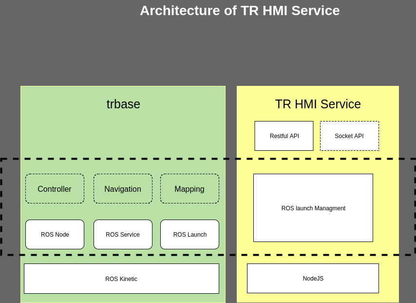
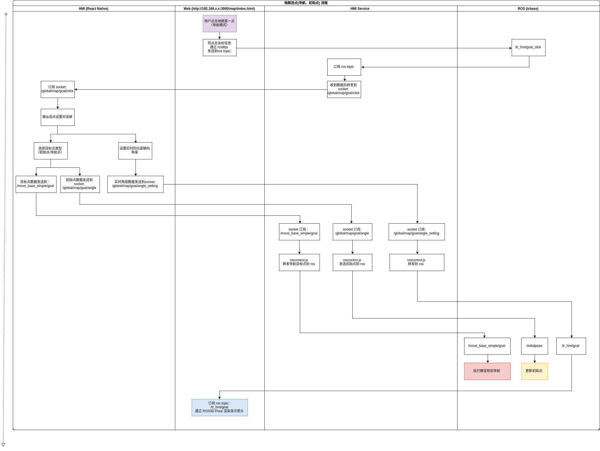

# TR HMI Services 开发指南

## 概述

TR HMI Service 整体作为一个服务层，向上为移动端 APP 提供接口能力，与机器人底盘交互，
向下对接 ROS 层以及系统文件层，提供 ROS 服务/launch文件 的生命周期管理。

## 整体架构

## 源码目录结构

 - `src`
   - `data`
     - `config.js` //配置工具
     - `db.json`   //lowdb 生成的本地数据库文件（json）,存储底盘型号等配置信息，无需 git 管理。
     - `default.pgm` //预置的一张默认地图
     - `default.yaml` //预置的默认地图描述信息文件
     - `productions.json` //所有产品型号的配置表
   - `launch`
     - `tr_hmi.launch` //HMI 必需的基础laucn文件，包含 rosbridge、tf2_republish 等
     - `tr_hmi_with_cam.launch` //这个是额外配有摄像头的底盘的 launch 文件
   - `public` //存放静态 web 页
     - `img`
     - `js`
     - `map`
       - `css`
       - `img`
       - `js`
       - `index.html`   //3d 地图 web 页面
       - `index2d.html` //已废弃，2d 地图页面，无激光显示,
     - `index.html` //目前仅用于测试
   - `restful`
     - `controllers`
       - `map.js` //地图操作api,包括查询地图列表，加载地图，删除地图，保存当前地图（简图模式）
       - `roslaunch.js` //ros launch 文件管理，启动/停止 launch文件
       - `settings.js`  //系统配置类接口，包括默认地图配置，最大速度配置等
       - `speech.js`    //TR-XiaoBai 底盘转有功能，管理预设朗读文本，用于遥控小白朗读
       - `status.js`    //底盘状态接口，包括ros状态、系统资源占用、底盘配置信息等
     - `controllers.js` //API 路由自动发现注册
     - `index.js` //koa app 入口
   - `roscontrol` //使用 rosnodejs 启动一个node节点，通过订阅 socket 以及发布 ros topic 来实现 socket - ros 层的通讯桥接功能
     - `lib` //topic转发工具类，文件名对应 topic名字，用来发布对应的ros topic数据
       - `cmd_vel.js` //发布运动控制
       - `initialPose.js` //发布机器人初始点
       - `move_base_simple_goal.js` //发布路径规划导航目标点
       - `runlaunch.js` //在 childProcess 子进程内执行 `roslaunch` 命令行，实现launch 文件的启动和结束
       - `tr_hmi_goal.js` //设置初始点/目标点时，由 UI层(React) 向 ROS 发送实时角度,地图UI端订阅接受并实时渲染显示箭头指向，产生反馈
      - `index.js` //ros 桥接管理入口，集中暴露所有功能
   - `socket`
     - `controllers.js` //所有 socket 接口控制器逻辑
     - `index.js` // socket 接口路由入口
   - `test` //测试小工具
   - `utils`
     - `lib`
       - `osutils.js` //重新封装 nodejs/os 部分功能，提供系统资源占用状态查询
     - `argvHandler.js` //简单封装命令行参数工具，用于处理启动参数，如 `node src/index.js --product=abel05`
     - `jsonFileUtil.js` //json 文件读写工具类
     - `rosMath.js` //ROS 数学计算工具类
     - `simspawn.js` //简单封装 childProcess 的 spawn,用于管理子进程,执行命令行
     - `singletonDB.js` //单例模式封装的 lowdb （极简的基于 json 的数据持久化工具）
     - `sysmonitor.js`  //用 promise 封装了 `osutils.js` 内的部分功能，提供一键查询系统状态的功能
   - `index.js` //HMI 服务入口

## 详细设计以及功能

### 地图选点以及目标点/初始点设置详解

流程图：

### 开机启动

推荐使用 `pm2` 管理 node 服务，利用 `pm2 startup ` 来实现服务的开机启动，进而实现底盘开箱即用。